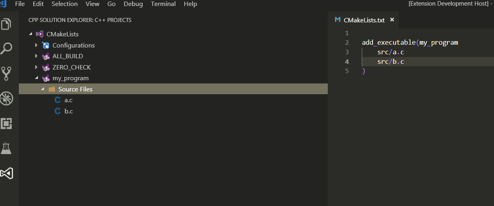
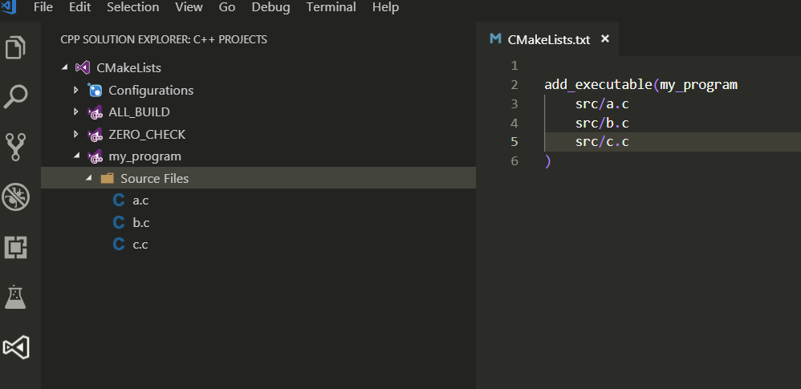
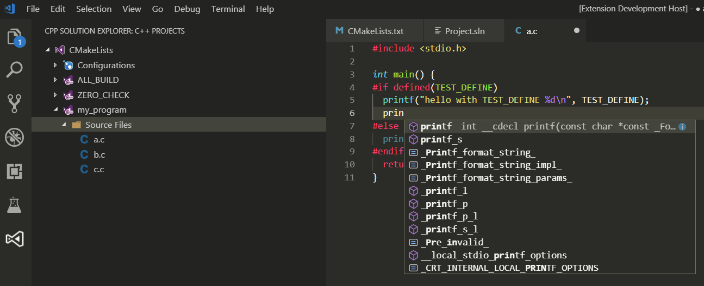
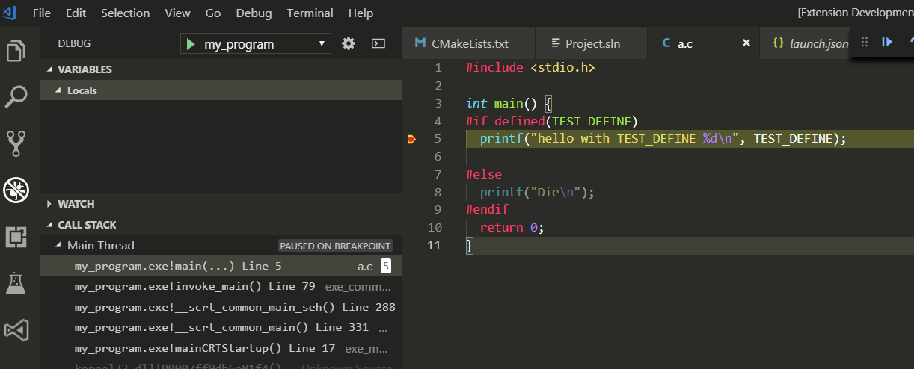
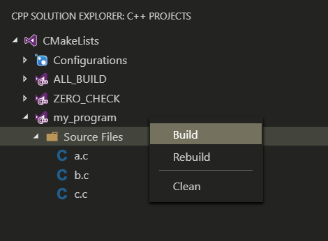
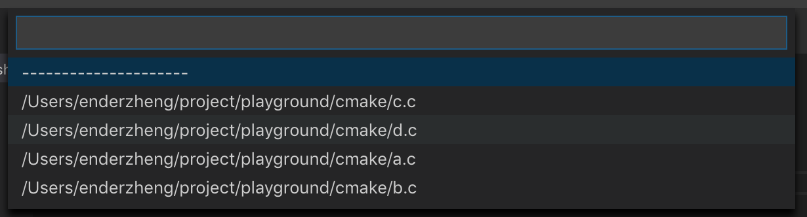

# Cpp Solution Explorer
Makes vscode a liteweight cross-platform IDE

## Summary
With help of the greate extension "cpptools", vscode already has the capablities of build, debug and some sort of code auto-complete, but 

- You have to write configurations in c_cpp_property.json by manual
- You have to write build script in tasks.json by manual
- You have to write Launch script in launch.json by manual
- The workspace is structured by folders instead of projects

In short: it's not like Visual Studio, in which you don't have to worry about anything above. When you open a file in a vs project, configs like include/defines are prepared automatically so that auto-complete works well, and you can build/debug your target simply by clicking some buttons.

Cpp Solution Explorer will make vscode more "Visual Studio" likely, with the help of CMake and cpptools extension. It will

- Parse CMakeLists.txt under the root folder
- Load projects in CMakeLists.txt and struct the source files by projects
- Generate c_cpp_property.json with the information (include pathes, preprocessor defines) get from cmake
- Generate build script and launch script automatically
- Update c_cpp_property.json whenever you select a source file, so that intellisense works all the time

Also you can build/rebuild/clean in project view.

## Features
- Load cmake project automatically

- Reload cmake project after CMakeLists.txt changes

- Auto generate c_cpp_property.json, launch.json and tasks.json, makes auto-complete, build and debug works

- You can also build/rebuild/clean target from inside project view

- Search strings in all files under solution (shift+alt+f/shift+option+f)

- Pickup a file from quick-pickup panel (shift+alt+o/shift+option+o)

- Pickup a c++ function from quick-pickup panel (shift+alt+s/shift+option+s)

## Inspiration

- CLion

  Clion also use cmake as its underlining project engine, it will run cmake -G CodeBlock ... to get a CodeBlock project, inside which we can get everything we want.

  Cpp Solution Explorer also generate CodeBlock project in *nix systems, but not for Windows. In Windows we generate Visual Studio solutions. Cpp Solution Explorer works on both backend.

- vscode-solution-explorer

  This is a great extension that makes vscode so powerfull that you can forget about Visual Studio ( actually you can't :-) ) if you are from .Net world.
